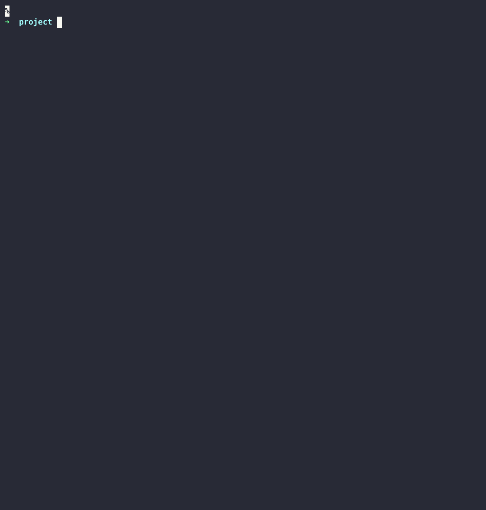

## Introduction

Guku DevX is a tool for building developer-centric interfaces for your internal developer platform (IDP). Use DevX to standardise how developers run apps and enable infrastructure self-service.

**Developer-centric configurations using a single config for all envrionments, for all vendors!**


## Quick start
```bash
➜ devx project init
➜ devx project update
➜ devx project gen
➜ devx build dev
🏭 Transforming stack for the "dev" environment...
[compose] applied resources to "build/dev/compose/docker-compose.yml"
[terraform] applied resources to "build/dev/terraform/generated.tf.json"
```




## Usage

### Configuration language
We use [CUE](https://cuelang.org/) to write strongly typed configurations. You can now shift YAML typos left, instead of detecting errors when applying configurations. You can easily transform CUE configuration files to and from YAML (CUE is a superset of YAML & JSON).

[CUE](https://cuelang.org/) is the result of years of experience writing configuration languages at Google, and seeks to improve the developer experience while avoiding some nasty pitfalls. CUE looks like JSON, while making declarative data definition, generation, and validation a breeze. You can find a primer on CUE [here](https://docs.dagger.io/1215/what-is-cue/#understanding-cue).


### Create a stack (by Developers)
You create a stack to define the workload and its dependencies.
```cue
package main

import (
	"guku.io/devx/v1"
	"guku.io/devx/v1/traits"
)

stack: v1.#Stack & {
	components: {
		cowsay: {
			v1.#Component
			traits.#Workload
			containers: default: {
				image: "docker/whalesay"
				command: ["cowsay"]
				args: ["Hello DevX!"]
			}
		}
	}
}
```

### Create your own stack builders or use community packages (by Platform Engineers)
You can customize how the stack is processed by writing declarative transformers.
```cue
package main

import (
	"guku.io/devx/v1"
	"guku.io/devx/v1/transformers/compose"
)

builders: v1.#StackBuilder & {
	dev: {
		mainflows: [
			v1.#Flow & {
				pipeline: [
					compose.#AddComposeService & {},
				]
			},
		]
	}
}
```

### Validation
Validate configurations while writing
```bash
➜ devx project validate
👌 Looks good
```

### Platform capability discovery
```bash
➜ devx project discover --transformers
[🏷️  traits] "guku.io/devx/v1/traits"
traits.#Workload	a component that runs a container 
traits.#Replicable	a component that can be horizontally scaled 
traits.#Exposable	a component that has endpoints that can be exposed 
traits.#Postgres	a postgres database 
traits.#Helm	a helm chart using helm repo 
traits.#HelmGit	a helm chart using git 
traits.#HelmOCI	a helm chart using oci 

[🏭 transformers] "guku.io/devx/v1/transformers/argocd"
argocd.#AddHelmRelease	add a helm release  (requires trait:Helm)

[🏭 transformers] "guku.io/devx/v1/transformers/compose"
compose.#AddComposeService	add a compose service  (requires trait:Workload)
compose.#ExposeComposeService	expose a compose service ports  (requires trait:Exposable)
compose.#AddComposePostgres	add a compose service for a postgres database  (requires trait:Postgres)

[🏭 transformers] "guku.io/devx/v1/transformers/terraform"
terraform.#AddHelmRelease	add a helm release  (requires trait:Helm)
```

## Package management

You can publish and share CUE packages directly through git repositories.

### Create a new packages
Create a new repository to store your packages (you can host multiple packages per repository).

```bash
pkg
└── domain.com
    └── package1
        ├── cue.mod
        |   └── module.cue # module: "domain.com/package1"
        └── file.cue
```

### Add the package to `module.cue`
```cue
module: ""

packages: [
  "github.com/<org name>/<repo name>@<revision>/pkg/domain.com",
]		
```

### For private packages (optional)
```bash
export GIT_USERNAME="username"
export GIT_PASSWORD="password"
```
or
```bash
export GIT_PRIVATE_KEY_FILE="path/to/key"
export GIT_PRIVATE_KEY_FILE_PASSWORD="password"

```

### Update packages (pulling updates will replace existing packages)
```
➜ devx project update
```
